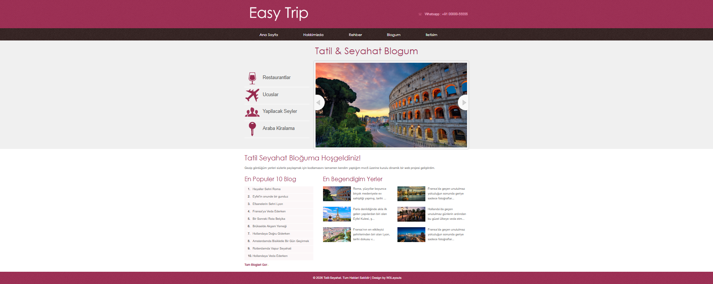
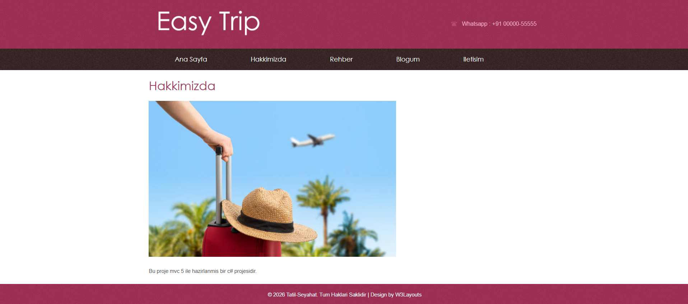
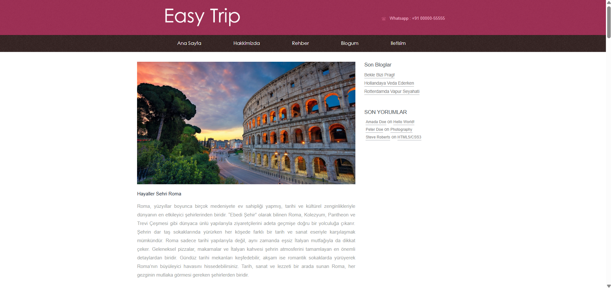
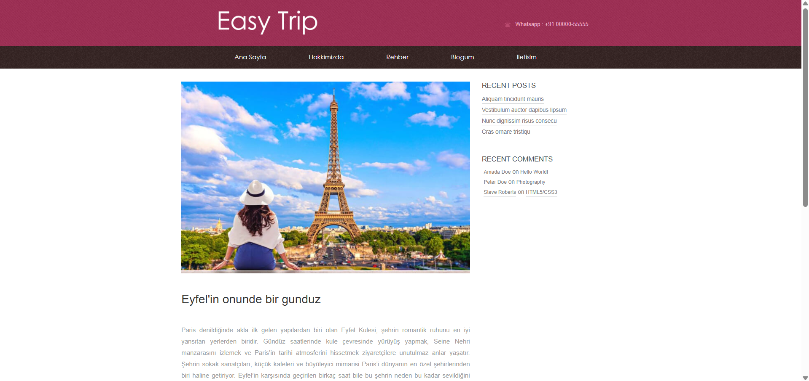
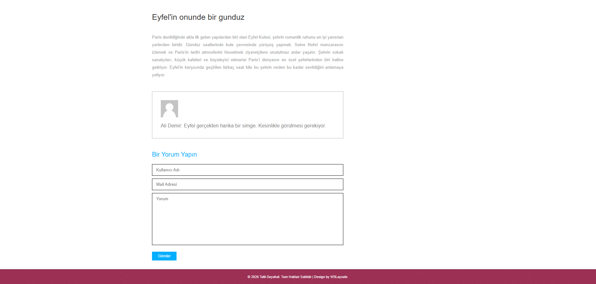
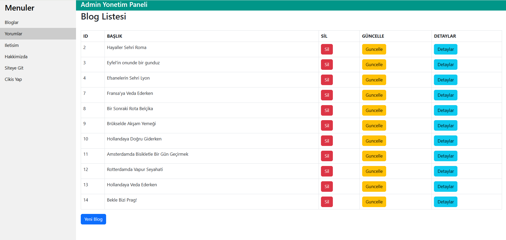
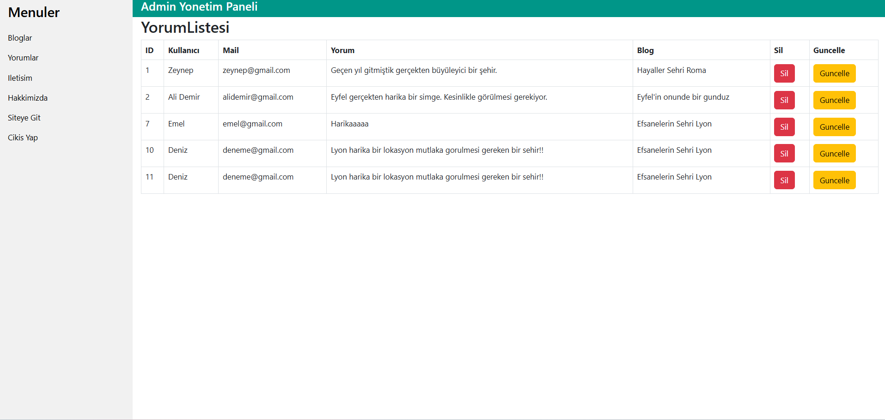
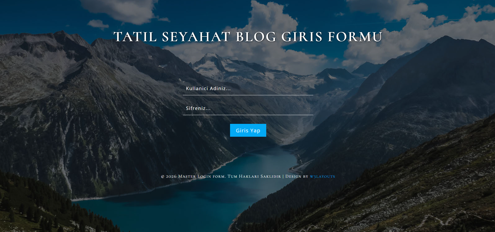

# 🌍 Travel Trip Project


A web-based travel blog and tourism management platform developed with ASP.NET MVC 5 and Entity Framework.

## 🚀 Technologies Used

* ASP.NET MVC 5
* C#
* Entity Framework
* SQL Server
* Bootstrap
* Partial Views
* HTML5
* CSS3

## ✨ Features

👤 Visitor Features
* View the most popular blog posts on the homepage
* Explore administrator's featured destinations
* Browse travel blog content
* View detailed blog posts
* Leave comments on blog articles
* Send messages through the contact form

🔐 Admin Panel Features
* Secure authentication system
* Create, update, and delete blog posts
* Manage visitor comments
* View all blogs and comments from a centralized dashboard
* Protected admin panel using ASP.NET MVC Authorization

## ⚙️ Installation

1. Clone the repository

```bash
git clone https://github.com/Kaandalgar/TravelTripProject.git
```

2. Open the solution file in Visual Studio

```txt
TravelTripProje.sln
```

3. Update the SQL Server connection string in `Web.config`

```xml
<connectionStrings>
  <add name="Context"
       connectionString="Data Source=YOUR_SERVER_NAME; Initial Catalog=TravelDb; Integrated Security=True;"
       providerName="System.Data.SqlClient" />
</connectionStrings>
```

4. Open Package Manager Console and run the migration/database command if needed

```powershell
Update-Database
```

5. Run the project with IIS Express or press `F5`.

## 📌 Notes

* This project uses Entity Framework Code First.
* The database name is `TravelDb`.
* The connection string should be updated according to the local SQL Server instance.
* The admin panel is protected using Forms Authentication.
* The UI is based on a customized ready-made theme.
* Blog content, comments, and site data are dynamically managed through the database.

## 📸 Screenshots

### Home Page



### Blog Page



### Blog Detail



### Blog Detail & Content View



### Comment System



### Admin Panel - Blog Management



### Admin Panel - Comment Management



### Login Page



## 🎯 Purpose

This project was developed as part of my ASP.NET MVC learning journey to gain hands-on experience with MVC architecture, Entity Framework, SQL Server integration, authentication, CRUD operations, and admin panel development.

## 👨‍💻 Developer

**İbrahim Kaan Dalgar**
Software Engineer

GitHub: (https://github.com/Kaandalgar)

LinkedIn: (https://www.linkedin.com/in/kaan-dalgar)
